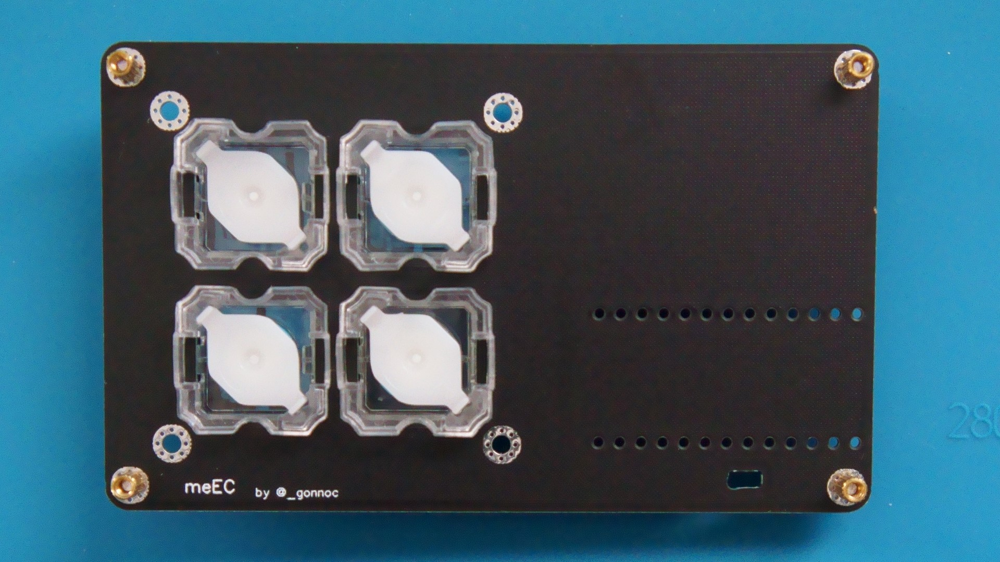

# meEC

- [部品リスト](#部品リスト)
  - [キットに同梱されている部品](#キットに同梱されている部品)
  - [キット以外に必要な部品](#キット以外に必要な部品)
- [組み立て手順](#組み立て手順)
  - [EC microにType-Cコネクタをはんだ付けする](#ec-microにtype-cコネクタをはんだ付けする)
  - [(メイン基板にLEDをはんだ付けする)](#メイン基板にledをはんだ付けする)
  - [メイン基板にリセットスイッチをはんだ付けする](#メイン基板にリセットスイッチをはんだ付けする)
  - [メイン基板にEC microを取り付ける](#メイン基板にec-microを取り付ける)
  - [トッププレートにスペーサーをネジ止めする](#トッププレートにスペーサーをネジ止めする)
  - [トッププレートにスイッチを取り付ける](#トッププレートにスイッチを取り付ける)
  - [トッププレートとメイン基板をネジ止めする](#トッププレートとメイン基板をネジ止めする)
- [ファームウェア](#ファームウェア)

## 部品リスト
### キットに同梱されている部品
|部品|数|
|-|-|
|EC micro|1|
|USB Type-C コネクタ|1|
|メイン基板|1|
|トッププレート|1|
|タクトスイッチ|1|
|M2ネジ|8|
|M2x5スペーサー|4|
|ゴム足|4|


### キット以外に必要な部品

|部品|数|入手先|
|-|-|-|
|12ピンコンスルーまたはピンヘッダ|2|
||||
|**BTOスイッチ用**|
|ADELCPS 静電容量スイッチ4点セット|4|
||||
|**NIZ ECスイッチ用**|
|NIZ EC Switch |4|
|ラバードーム|必要分|
|コニックリング|4|
||||
|**LED対応版オプション**|||
|YS-SK6812MINI-E|4|

## 組み立て手順
### EC microにType-Cコネクタをはんだ付けする
- 出荷時に貼り付けてあるカプトンテープは剥がさないほうが他の部品とブリッジしづらい


### (メイン基板にLEDをはんだ付けする)
- 行によってLEDの向きが違うので注意してください

### メイン基板にリセットスイッチをはんだ付けする
### メイン基板にEC microを取り付ける
- コンスルーを使う場合、EC micro側もメイン基板側もはんだ付けは不要
- コンスルーはスイッチ側に寄せる


### トッププレートにスペーサーをネジ止めする
### トッププレートにスイッチを取り付ける


### トッププレートとメイン基板をネジ止めする

## ファームウェア
- リポジトリを取得
  - https://github.com/sekigon-gonnoc/qmk_firmware/tree/dev/sekigon
- atmel-dfu経由で書き込み
  - リセットすると自動でブートローダが起動する
  ```
  make meEC:dfu
  ```
